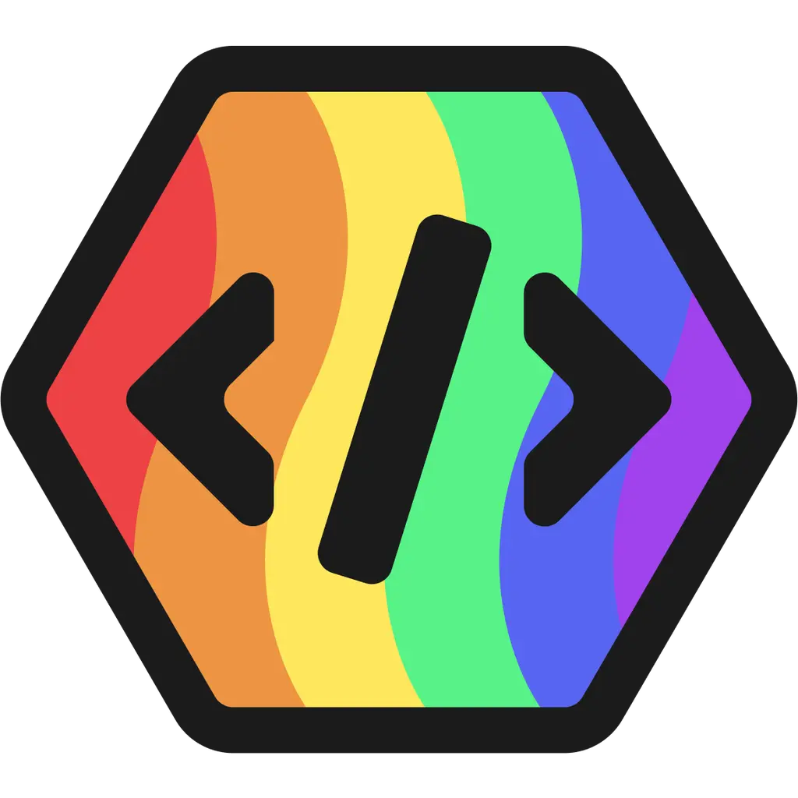

#  Pridebot

[🚀 Invite to Server](https://pridebot.xyz/invite) • [📚 Documentation](https://pridebot.xyz) • [💬 Support Server](https://pridebot.xyz/support) • [💎 Premium](https://pridebot.xyz/premium)

## Introduction

Pridebot, developed by [Sdriver1](https://sdriver1.me), is a multi function LGBTQIA+ themed discord application set to make information and acceptance accessible to more users. Currently the bot is apart of 8.3k+ server reaching to 690k+ users. The bot been used over 1.1M+ times with features ranging from profile system where users can in organize way express there identities, avatar editors to rep your flag, educational for identities and supportive resources for mental health or coming out, and finally fun little minigames to mess with your friends.

## Features

Pridebot offers a range of features to assist users in learning and discussing LGBTQ+ topics, including:

- **Informative Commands**: Access detailed explanations and resources about sexualities, genders, and pronouns.
- **Identity Exploration**: Tools and guidance for users questioning or exploring their identity.
- **Tips and Help**: Tools on how to come out to others and helplines and resources for people going through mental health emergencies are available, too.
- **Fun and More**: Check out the Fun commands for gay fun or check out the Pride commands for all the little jokes

## Getting Started

To add Pridebot to your Discord server, follow these two simple steps:

1. **Invite Pridebot**: Use this [invitation link](https://pridebot.xyz/invite) to add Pridebot to your Discord server.
2. **Explore Commands**: Use `/help` to explore the various commands and features offered by Pridebot.

## Commands

Here is a list of the commands you can use with Pridebot:

- **Avatar** - `/avatar-list`, `/avatar-view`, and `/prideavatar`
- **Fun** - `/gaydar`, `/lgbtq`, `/match`, `/pronountester`, `/queerdar`, and `/transdar`
- **Pride**
  - **Sexualities** - `/asexual`, `/bisexual`, `/gay`, `/lesbian`, `/pansexual`, and `/queer`
  - **Genders** - `/genderfluid`, `/nonbinary`, and `/trans`
  - **Months** - `/pridemonth`
- **Profiles** - `profile setup`, `profile view`,`profile edit`, and `profile update`
- **Support** - `/comingout`, `/mentalhealth`, and `/transresources`
- **Terms** - `/gender`, `/other`, `/pronouns`, and `/sexuality`
- **Tools** - `/donate`, `/help,`, `/partner`, `/stats`, and `/vote`

- **User Apps** - `User Avatar-view`, `User Gaydar`, `User Profile`, `User Queersdar`, and `User Transdar`

## Contribution

Contributions to Pridebot are welcome! If you're interested in contributing, please:

- **Bugs / Features**: Join the Support Server below to report any bugs or suggest any features!
- **Pull Request**: I go through pull request alot so if you want to code anything into the bot, you are free too!
- **Voting**: Vote for Pridebot on [Botlist.me](https://botlist.me/bots/1101256478632972369/vote) and [Top.gg](https://top.gg/bot/1101256478632972369/vote)

## Support

For support, questions, or feedback about Pridebot, please join our Discord community [here](https://pridebot.xyz/support).
For anyone who wants to donate/support the development of Pridebot, you can do that [here](https://pridebot.xyz/premium)

## 📜 Legal

| Document | Description |
|----------|-------------|
| [Terms of Service](https://pridebot.xyz/tos) | Usage terms and conditions |
| [Privacy Policy](https://pridebot.xyz/privacy) | How we handle your data |
| [MIT License](https://github.com/Pridebot-Systems/Pridebot?tab=MIT-1-ov-file) | Open source license |

---

**Made with ❤️ by the Pridebot team**

🏳️‍🌈 *Pridebot © 2023-2025 - Celebrating diversity, one server at a time* 🏳️‍⚧️

